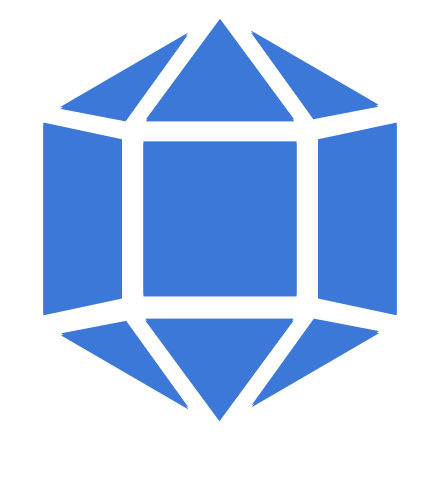
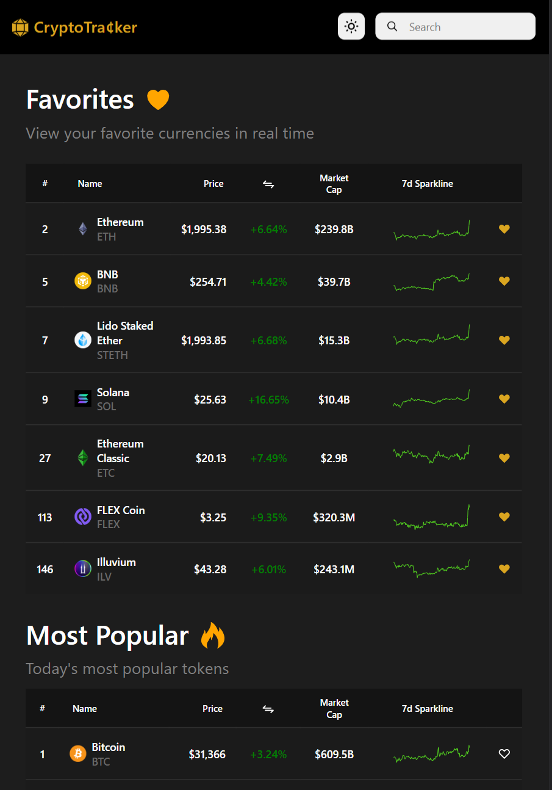
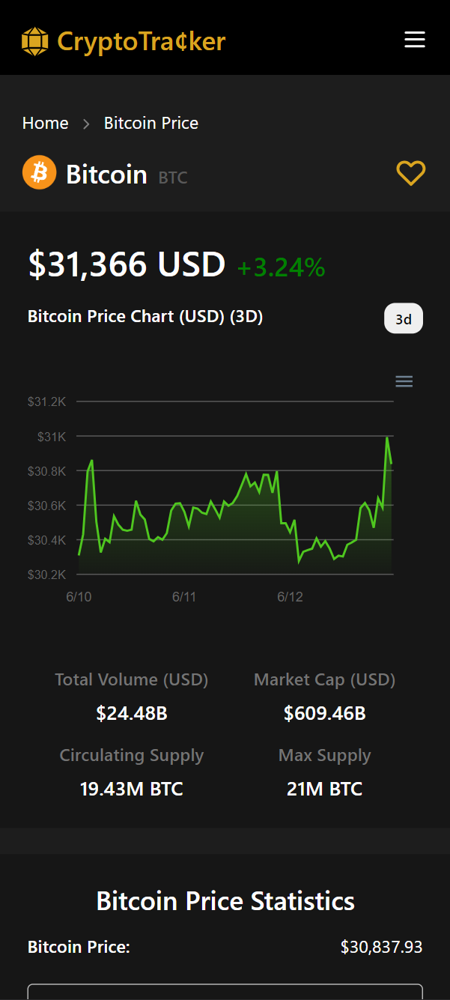
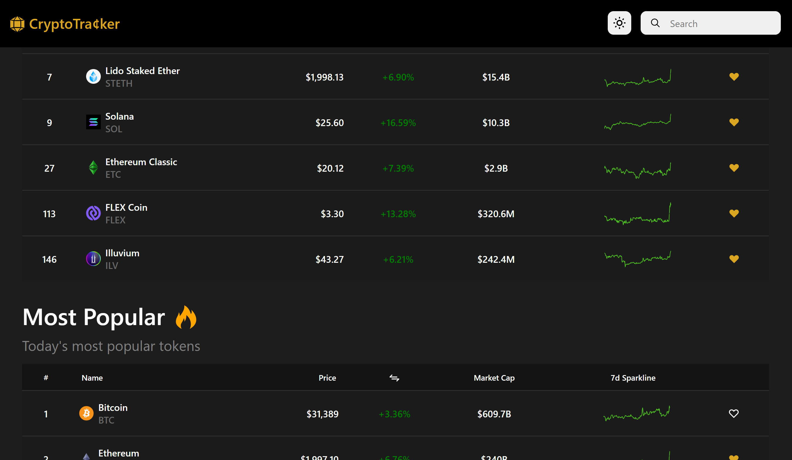

<p align="center">
  
</p>

<p align="center">
  A web application that tracks and analyzes cryptocurrencies
</p>

------
## **About the Project** 🔎

A web application that tracks and analyzes the cryptocurrency market in real time. 

Languages used: 

1. TypeScript
2. CSS

Modules/Libraries used:

1. [Axios](https://github.com/axios/axios)
2. [Redux & Redux Toolkit](https://github.com/reduxjs/redux)
3. [React Router v6](https://github.com/remix-run/react-router)
4. [Lodash](https://github.com/lodash/lodash)
5. [ApexCharts & React-ApexCharts](https://github.com/apexcharts/apexcharts.js/)

API's used:

1. [News API](https://newsapi.org/)
2. [Currency Exchange Rate API](https://www.exchangerate-api.com/)


## **Features** 📦️
- [x] Real time cryptocurrency prices & other informaton (updates every 5-6 minutes)
- [x] Ability to add tokens to a favorites list
- [x] Daily news
- [x] Ability to find and search for crypto
- [x] Token analysis page, featuring...
  * Current prices
  * A line chart displaying current price over time w/ time scope filters 
  * Other relevant information
  * Currency conversion calculators
  * Recommendations

## **How to Setup 🛠️**
Clone this repository

```bash
git clone https://github.com/KennethOnuorah/CryptoTracker.git
cd CryptoTracker
```

Install dependencies
```bash
npm i
```

Run the development server

```bash
npm run dev
```

## **Screenshot** 📷
| Tablet | Mobile |
|:---:|:---:|
|  |   |

| Desktop |
|:---:|
|  |

## **License** 📜
[**MIT**](https://github.com/KennethOnuorah/CryptoTracker/blob/master/LICENSE)
